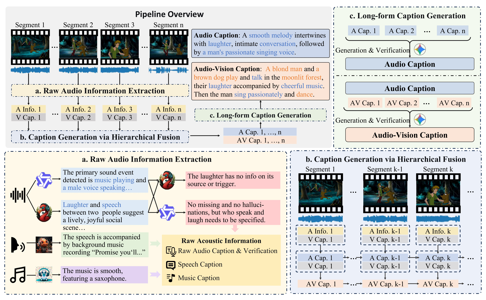

<div align="center">
<br>
<h1>Empowering Long-form Omni-modal Understanding with Robust Audio Perception</h1>
</div>
  
We propose **AVDC (Audio-Visual Decoupled Captions)** dataset, a large-scale dataset designed to disentangle visual and auditory semantics, to improve omni understanding in multimodal models.
While recent multimodal models have achieved strong performance in vision-language tasks, they often struggle with fine-grained audio-visual alignment, mainly due to the lack of such structured data. 
This project addresses that gap by providing both data and training pipelines for better omni-modal perception.


## Dataset 

### Pipeline
We propose an automatic pipeline for audio-visual decoupled caption generation, 
where multiple audio and language models extract and verify auditory information, 
temporally align it with visual content to produce segment-level captions, 
and finally aggregate them into a coherent global caption with subsequent verification and refinement.

<p align="center">
    
</p>

### Example

<p align="center">
    
    <br>
    <em>Example of a multiple-choice problem. Time-related content is shown in red, and visual and audio cues in orange and blue.
</em>
</p>


## How to train

1. Prepare the dataset following `data/example.json`.
2. Download LLaVA-OneVision Model from [huggingface](https://huggingface.co/Qwen/Qwen2.5-Omni-7B).
3. Modify the parameters in `sft_omni_eval.sh`.
4. Run `bash sft_omni_eval.sh`.


## Citation

If you find WorldSense helpful for your research, please consider citing our work. Thanks!

```bibtex

```